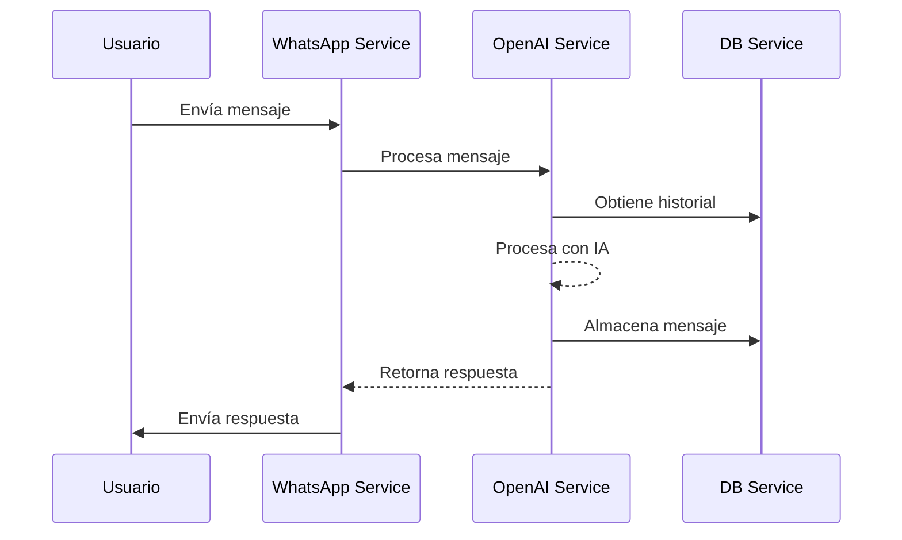

# TuthorIA - Asistente Educativo con WhatsApp

Este proyecto implementa un asistente educativo a través de WhatsApp utilizando la API de WhatsApp Business y modelos avanzados de IA para generar sesiones de aprendizaje personalizadas.

## Arquitectura del Sistema

El sistema está compuesto por tres microservicios:

1. WhatsApp Service (Puerto 8501)
   - Gestiona la comunicación con otros servicios
   - Procesa y enruta los mensajes
   - Maneja el almacenamiento de mensajes
   - Endpoint principal: `/chat`
   - Endpoint de salud: `/health`

2. OpenAI Service (Puerto 8502)
   - Procesa los mensajes usando LangChain
   - Mantiene el historial de conversaciones
   - Genera respuestas con IA
   - Endpoints principales: `/chat`, `/conversations/{user_id}`
   - Endpoint de salud: `/health`

3. DB Service (Puerto 8000)
   - Almacena el historial de conversaciones
   - Gestiona la persistencia de mensajes
   - API REST para gestión de datos
   - Endpoints principales: `/api/v1/conversations/*`
   - Endpoint de salud: `/health`

### Flujo de Mensajes


### Formato de Mensajes

Los mensajes siguen un formato estándar en todo el sistema:

```json
{
    "user_id": "string",      # ID del usuario (número de WhatsApp)
    "content": "string",      # Contenido del mensaje
    "message_type": "text",   # Tipo de mensaje (opcional)
}
```

Para más detalles técnicos, consulte [TECHNICAL.md](TECHNICAL.md).

## Estructura del Proyecto

```bash
.
├── whatsapp-service/       # Servicio principal de WhatsApp
│   ├── app.py              # Aplicación FastAPI
│   ├── Dockerfile          # Configuración de contenedor
│   ├── railway.toml        # Configuración de Railway
│   ├── handlers/           # Manejadores de webhooks
│   └── services/           # Servicios de negocio
│
├── openai-service/        # Servicio de procesamiento IA
│   ├── app.py             # Aplicación FastAPI
│   ├── Dockerfile         # Configuración de contenedor
│   ├── railway.toml       # Configuración de Railway
│   ├── services/          # Lógica de IA y chat
│   ├── config/            # Configuraciones
│   ├── models/            # Modelos de datos
│   └── shared/            # Recursos compartidos
│
├── db-service/            # Servicio de base de datos
│   ├── app.py             # Aplicación FastAPI
│   ├── Dockerfile         # Configuración de contenedor
│   ├── railway.toml       # Configuración de Railway
│   ├── models/            # Modelos MongoDB
│   ├── routes/            # Endpoints API
│   ├── scripts/           # Scripts de inicialización
│   └── tests/             # Pruebas unitarias
│
├── compose.yml            # Configuración Docker principal
├── compose.override.yml   # Configuración desarrollo
└── README.md              # Documentación principal
```

## Requisitos Previos

Para ejecutar este proyecto necesitas:

- Docker y Docker Compose (desarrollo local)
- Cuenta de WhatsApp Business API
- Acceso a la API de OpenAI
- Cuenta de MongoDB Atlas

## Configuración del Entorno

Cada servicio requiere su propio archivo .env:

1. WhatsApp Service (.env):
```env
WHATSAPP_VERIFY_TOKEN=token
WHATSAPP_ACCESS_TOKEN=token
WHATSAPP_API_URL=url
OPENAI_SERVICE_URL=http://openai-service:8502
DB_SERVICE_URL=http://db-service:8000/api/v1
```

2. OpenAI Service (.env):
```env
OPENAI_API_KEY=tu_api_key
DB_SERVICE_URL=http://db-service:8000/api/v1
```

3. DB Service (.env):
```env
MONGODB_USER=usuario
MONGODB_PASSWORD=contraseña
MONGODB_HOST=tu.mongodb.host
```

## Desarrollo Local

1. Construir y ejecutar los servicios:
```bash
docker compose up --build
```

2. Para desarrollo con hot-reload:
```bash
docker compose -f compose.yml -f compose.override.yml up
```

## Monitoreo y Salud

Cada servicio expone un endpoint `/health` que verifica:
- Estado del servicio
- Conexiones a servicios externos (WhatsApp Service)
- Conexión a base de datos (DB Service)
- Configuración de OpenAI API (OpenAI Service)

## Contribución

1. Fork el repositorio
2. Crea una rama para tu feature (`git checkout -b feature/amazing-feature`)
3. Commit tus cambios (`git commit -m 'feat: add amazing feature'`)
4. Push a la rama (`git push origin feature/amazing-feature`)
5. Abre un Pull Request

## Licencia

Este proyecto está bajo la Licencia MIT - ver el archivo [LICENSE](LICENSE) para más detalles.
