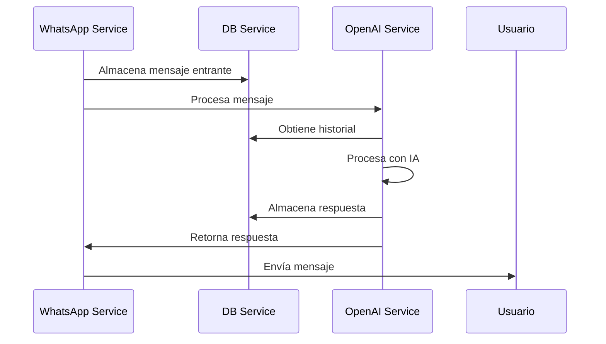

# TuthorIA - Asistente Educativo con WhatsApp

Este proyecto implementa un asistente educativo a través de WhatsApp utilizando la API de WhatsApp Business y modelos avanzados de IA para generar sesiones de aprendizaje personalizadas.

## Arquitectura del Sistema

El sistema está compuesto por tres microservicios:

1. WhatsApp Service (Puerto 8501)
   - Gestiona la integración con la API de WhatsApp
   - Enruta los mensajes al Servicio de OpenAI
   - Envía respuestas a los usuarios
   - Endpoint de salud: `/health`

2. OpenAI Service (Puerto 8502)
   - Procesa los mensajes usando LangChain
   - Mantiene el contexto de la conversación
   - Genera respuestas con IA

3. DB Service (Puerto 8000)
   - Almacena el historial de conversaciones
   - Gestiona la persistencia de mensajes
   - Proporciona recuperación de conversaciones

### Flujo de Mensajes


## Estructura del Proyecto

```bash
.
├── whatsapp-service/       # Servicio principal de WhatsApp
│   ├── app.py              # Aplicación FastAPI
│   ├── Dockerfile          # Configuración de contenedor
│   ├── railway.toml        # Configuración de Railway
│   ├── handlers/           # Manejadores de webhooks
│   └── services/           # Servicios de negocio
│
├── openai-service/        # Servicio de procesamiento IA
│   ├── app.py             # Aplicación FastAPI
│   ├── Dockerfile         # Configuración de contenedor
│   ├── railway.toml       # Configuración de Railway
│   ├── services/          # Lógica de IA y chat
│   ├── config/            # Configuraciones
│   ├── models/            # Modelos de datos
│   └── shared/            # Recursos compartidos
│
├── db-service/            # Servicio de base de datos
│   ├── app.py             # Aplicación FastAPI
│   ├── Dockerfile         # Configuración de contenedor
│   ├── railway.toml       # Configuración de Railway
│   ├── models/            # Modelos MongoDB
│   ├── routes/            # Endpoints API
│   ├── scripts/           # Scripts de inicialización
│   └── tests/             # Pruebas unitarias
│
├── compose.yml            # Configuración Docker principal
├── compose.override.yml   # Configuración desarrollo
└── README.md              # Documentación principal
```

## Requisitos Previos

Para ejecutar este proyecto necesitas:

- Docker y Docker Compose (desarrollo local)
- Cuenta de WhatsApp Business API
- Acceso a la API de OpenAI
- Cuenta de MongoDB Atlas

## Configuración del Entorno

Cada servicio requiere su propio archivo .env:

1. WhatsApp Service (.env):
```env
WHATSAPP_VERIFY_TOKEN=token
WHATSAPP_ACCESS_TOKEN=token
WHATSAPP_API_URL=url
OPENAI_SERVICE_URL=http://openai-service:8502
DB_SERVICE_URL=http://db-service:8000/api/v1
```

2. OpenAI Service (.env):
```env
OPENAI_API_KEY=tu_api_key
DB_SERVICE_URL=http://db-service:8000/api/v1
```

3. DB Service (.env):
```env
MONGODB_USER=usuario
MONGODB_PASSWORD=contraseña
MONGODB_HOST=tu.mongodb.host
```

## Desarrollo Local

1. Construir y ejecutar los servicios:
```bash
docker compose up --build
```

2. Para desarrollo con hot-reload:
```bash
docker compose -f compose.yml -f compose.override.yml up
```

## Despliegue en Railway

El proyecto está configurado para despliegue en Railway usando múltiples servicios:

1. Configuración de Servicios:
   - Cada servicio tiene su propio `railway.toml` y `Dockerfile`
   - Modo producción optimizado
   - Health checks configurados

2. Conexión entre Servicios:
   - Servicios se comunican a través de URLs internas de Railway
   - Formato: `https://{service-name}.railway.internal`

3. Pasos de Despliegue:
```bash
# Instalar CLI de Railway
npm i -g @railway/cli

# Autenticarse
railway login

# Vincular al proyecto existente
railway link

# Verificar estado
railway status
```

4. Variables de Entorno en Railway:
   - Configurar las variables de entorno para cada servicio
   - Actualizar URLs de servicios al formato `.railway.internal`

## Monitoreo y Salud

- Cada servicio expone un endpoint `/health`
- Railway monitorea la salud automáticamente
- Logs disponibles en el dashboard de Railway

## Optimización de Construcción

El servicio de OpenAI utiliza una construcción Docker multi-etapa:

- Construcción multi-etapa para separar dependencias
- Caché de wheels para paquetes Python
- Imagen base mínima (python:3.10-slim)
- Separación de dependencias de desarrollo

Para construir en desarrollo:
```bash
docker build -t openai-service:dev .
```

Para producción con imagen mínima:
```bash
docker build --target production -t openai-service:prod .
```
