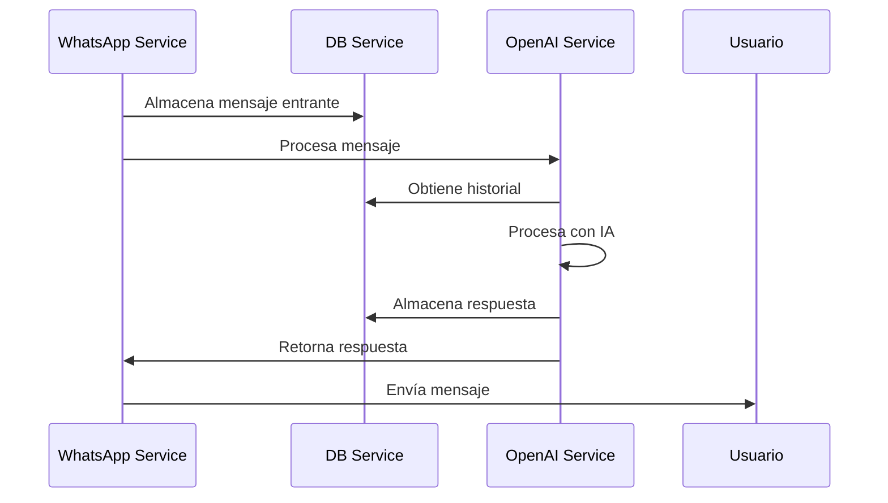

# TuthorIA - Asistente Educativo con WhatsApp

Este proyecto implementa un asistente educativo a través de WhatsApp utilizando la API de WhatsApp Business y modelos avanzados de IA para generar sesiones de aprendizaje personalizadas.

## Arquitectura del Sistema

El sistema está compuesto por tres microservicios:

1. WhatsApp Service (Puerto 8501)
   - Gestiona la integración con la API de WhatsApp
   - Enruta los mensajes al Servicio de OpenAI
   - Envía respuestas a los usuarios

2. OpenAI Service (Puerto 8502)
   - Procesa los mensajes usando LangChain
   - Mantiene el contexto de la conversación
   - Genera respuestas con IA

3. DB Service (Puerto 8000)
   - Almacena el historial de conversaciones
   - Gestiona la persistencia de mensajes
   - Proporciona recuperación de conversaciones

### Flujo de Mensajes


### Estructura del Proyecto

```bash
.
├── compose.override.yml     # Configuración de desarrollo
├── compose.yml             # Configuración principal de Docker
├── openai-service/         # Servicio de OpenAI
│   ├── app.py             # Aplicación principal
│   ├── Dockerfile         # Configuración de contenedor
│   └── services/          # Servicios del módulo
├── whatsapp-service/      # Servicio de WhatsApp
│   ├── app.py            # Aplicación principal
│   ├── Dockerfile        # Configuración de contenedor
│   └── handlers/         # Manejadores de eventos
└── db-service/           # Servicio de Base de Datos
    ├── app.py           # Aplicación principal
    ├── Dockerfile       # Configuración de contenedor
    └── routes/          # Rutas de la API
```

## Requisitos Previos

Para ejecutar este proyecto necesitas:

- Docker y Docker Compose
- Cuenta de WhatsApp Business API
- Acceso a la API de OpenAI
- Cuenta de MongoDB Atlas

## Configuración del Entorno

Cada servicio requiere su propio archivo .env:

1. WhatsApp Service (.env):
```env
WHATSAPP_VERIFY_TOKEN=token
WHATSAPP_ACCESS_TOKEN=token
WHATSAPP_API_URL=url
OPENAI_SERVICE_URL=http://openai-service:8502
DB_SERVICE_URL=http://db-service:8000/api/v1
```

2. OpenAI Service (.env):
```env
OPENAI_API_KEY=tu_api_key
DB_SERVICE_URL=http://db-service:8000/api/v1
```

3. DB Service (.env):
```env
MONGODB_USER=usuario
MONGODB_PASSWORD=contraseña
MONGODB_HOST=tu.mongodb.host
```

## Ejecución con Docker

1. Construir y ejecutar los servicios:
```bash
docker-compose up --build
```

2. Para desarrollo:
```bash
docker compose -f compose.yml -f compose.override.yml up
```

3. Detener los servicios:
```bash
docker compose down
```

## Optimización de Construcción

El servicio de OpenAI utiliza una construcción Docker multi-etapa para minimizar el tamaño final de la imagen:

- Construcción multi-etapa para separar dependencias
- Caché de wheels para paquetes Python
- Imagen base mínima (python:3.10-slim)
- Separación de dependencias de desarrollo

Para construir en desarrollo:
```bash
docker build -t openai-service:dev .
```

Para producción con imagen mínima:
```bash
docker build --target production -t openai-service:prod .
```
